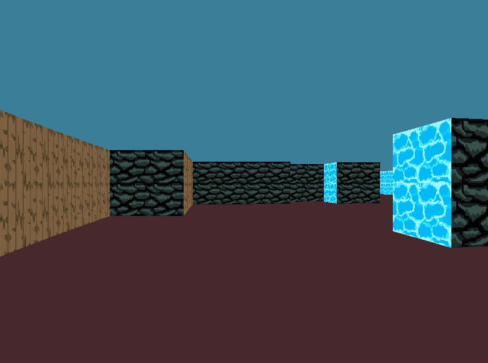

# Cub3D - 3D Maze Rendering

## Description

Cub3D is a project developed as part of an assignment. The primary objective is to create a realistic 3D graphical representation of the inside of a maze from a first-person perspective using Ray-Casting principles.

## Table of Contents

- [Prerequisites](#prerequisites)
- [Compilation](#compilation)
- [Usage](#usage)
- [Controls](#controls)
- [Mandatory Features](#mandatory-features)
- [Bonus Features](#bonus-features)
- [Author](#author)
- [License](#license)

## Prerequisites

Before compiling and running Cub3D, ensure that you have the following prerequisites:

- [GCC](https://gcc.gnu.org/) (GNU Compiler Collection) for compiling C code.
- [Make](https://www.gnu.org/software/make/) utility for managing build processes.

## Compilation

To compile Cub3D, follow these steps:

1. Clone the Cub3D repository to your local machine:

   ```
   git clone git@github.com:Exerath-42/cub3D.git
   ```

2. Change the directory to the Cub3D project folder:

   ```
   cd cub3d
   ```

3. Run the `make` command to compile the program:

   ```
   make
   ```

This will generate an executable named `cub3D`.

## Usage

Once the program is compiled, you can run it using the following command:

```
./cub3D <map_file.cub>
```

Replace `<map_file.cub>` with the path to your scene description file in `.cub` format. The program will load the specified map and render the 3D maze.

You can also use pre-made maps located in the `/maps` directory.

## Controls

- **Movement**: Use the WASD keys to move through the maze.
- **Camera Rotation**: Use the left and right arrow keys to rotate the camera left and right.
- **Door Interaction**: Press the SPACE key to interact with doors (open/close).

## Mandatory Features

The Cub3D program implements the following mandatory features:

- 3D graphical representation of a maze.
- Ray-Casting principles for rendering.
- Smooth window management.
- Display different wall textures based on wall orientation (North, South, East, West).
- Customizable floor and ceiling colors.
- Keyboard controls for movement and rotation (arrow keys, WASD).
- Clean window closing via ESC key and window's red cross button.
- Parsing of scene description file in `.cub` format.
- Map composed of 0 (empty space), 1 (wall), and N/S/E/W (player start and orientation).
- Closed/surrounded map with error handling for invalid maps.
- Flexible order and formatting of elements in the scene description file.

Here's an example of a minimal `.cub` scene description:

```
NO ./path_to_the_north_texture
SO ./path_to_the_south_texture
WE ./path_to_the_west_texture
EA ./path_to_the_east_texture
F 220,100,0
C 225,30,0
1111111111111111111111111
1000000000110000000000001
1011000001110000000000001
1001000000000000000000001
111111111011000001110000000000001
100000000011000001110111111111111
11110111111111011100000010001
11110111111111011101010010001
11000000110101011100000010001
10000000000000001100000010001
10000000000000001101010010001
11000001110101011111011110N0111
11110111 1110101 101111010001
11111111 1111111 111111111111
```
